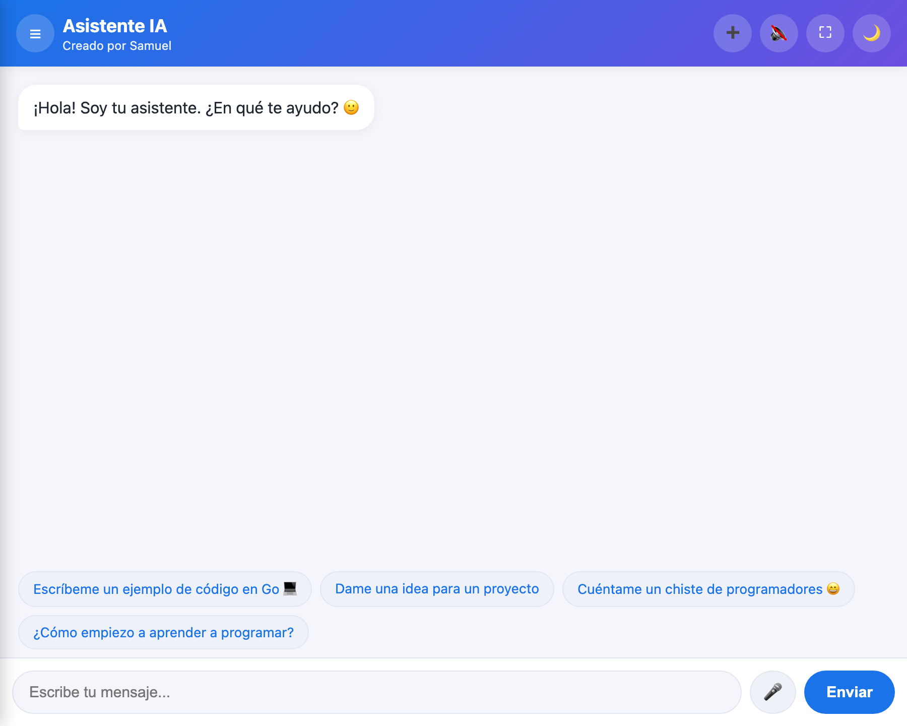
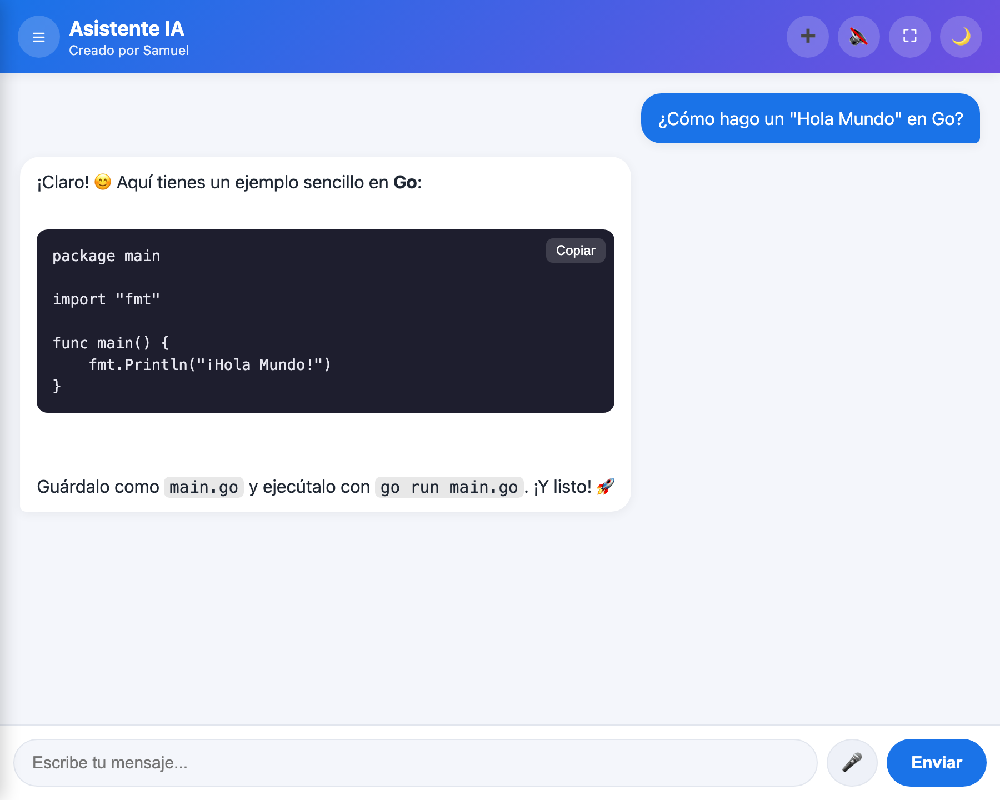

# Asistente IA 🤖

Asistente de chat con **Inteligencia Artificial**, multiplataforma (web, móvil y escritorio),
construido con **Flutter** y un **backend en Go**. Responde en *streaming* (palabra a palabra),
formatea el código, habla por voz y guarda tus conversaciones.

[](https://github.com/samuelcatalanz123/asistente-ia/actions/workflows/ci.yml)

🌐 **Pruébalo en vivo:** https://asistente-ia-xh5v.onrender.com

---

## 📸 Capturas

| Pantalla de inicio | Respuesta con código |
|--------------------|----------------------|
|  |  |

---

## ✨ Funciones

- 💬 **Chat con IA** en *streaming* (la respuesta aparece palabra a palabra, como ChatGPT)
- 💻 **Formato de código**: bloques con resaltado y botón de *copiar* — experto en programación
- 🎤 **Voz**: dicta tus mensajes por micrófono y escucha las respuestas en voz alta
- 🌍 **Bilingüe**: responde en el mismo idioma en el que le escribes (español / inglés)
- 🗂️ **Varias conversaciones** guardadas, con panel lateral (estilo ChatGPT)
- 🌙 **Modo oscuro** y diseño moderno y responsive
- 🛡️ **Seguridad**: la clave de la IA vive solo en el servidor; *rate limiting* por IP
- ⚙️ **CI**: tests de Go y Flutter ejecutados automáticamente en cada cambio

## 🏗️ Arquitectura

```
App Flutter / Web  →  Backend Go (/chat, /chat/stream)  →  Groq API (Llama 3.3)
```

La app envía la conversación al backend en Go. El backend añade la clave secreta
(guardada como variable de entorno, **nunca en el código**), aplica límite de peticiones
y reenvía la consulta a Groq, devolviendo la respuesta en *streaming* mediante
**Server-Sent Events (SSE)**.

## 🧰 Stack

| Capa | Tecnología |
|------|------------|
| Frontend | **Flutter / Dart** (móvil, escritorio) + cliente web en HTML/JS |
| Backend | **Go** (librería estándar, sin frameworks) |
| IA | **Groq API** — modelo Llama 3.3 (capa gratuita) |
| Hosting | **Render** (backend) |
| Calidad | **GitHub Actions** (CI), tests en Go y Flutter |

## ▶️ Cómo ejecutarlo

**Backend (Go):**
```bash
cd server
GROQ_API_KEY=tu_clave PORT=8090 go run .
# Comprobar:  curl localhost:8090/health
```

**App (Flutter):**
```bash
cd app
flutter pub get
flutter run                                  # usa por defecto el backend en Render
# Backend local:  flutter run --dart-define=BACKEND_URL=http://10.0.2.2:8090
```

## ✅ Tests

```bash
cd server && go test ./...     # tests del backend (handlers, streaming, rate limit)
cd app    && flutter test      # tests de la app
```

## 📂 Estructura

```
asistente-ia/
├── server/   Backend en Go (proxy seguro + streaming SSE + rate limiting)
├── app/      App Flutter (móvil, escritorio) + cliente web
└── .github/  Integración continua (CI)
```

---

Hecho por **Samuel Catalán** — proyecto de aprendizaje full-stack (Go + Flutter + IA).
